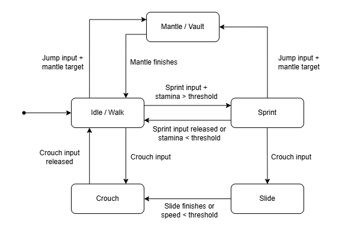

# FPS Traversal System
Custom movement system in Unreal Engine 5 with the goal to support more expressive movement modes.

---

## Features
- A character with full movement capabilities.
- Sprinting with stamina drain and visible stamina bar.
- Crouching under obstacles.
- Sliding as a combination between sprint and crouch.
- One advanced traversal mechanic:
  - vaulting/mantling over low or medium obstacles.
  - using traces to detect ledges and decide between a short vault vs full climb.

---

## Architecture
* Used the **Enhanced Input system** for key bindings.
* Clean separation between input code and movement logic:
  * Input logic handled in the **Game Character** class.
  * Movement logic is encapsulated in the **Custom Character Movement Component**.
* Defined a small internal “state machine” for custom movement modes as **Traversal Modes**.
* Exposed configuration data related to movement modes via UPROPERTY so they are easily tweakable.

___

## Movement Flow

___

## Assets used
* Unreal engine starting assets.
* [Free Animation Library](https://www.fab.com/listings/481ef75b-892b-424f-a213-f1cc058c9c19): crouch, mantle, vault, slide animations.
